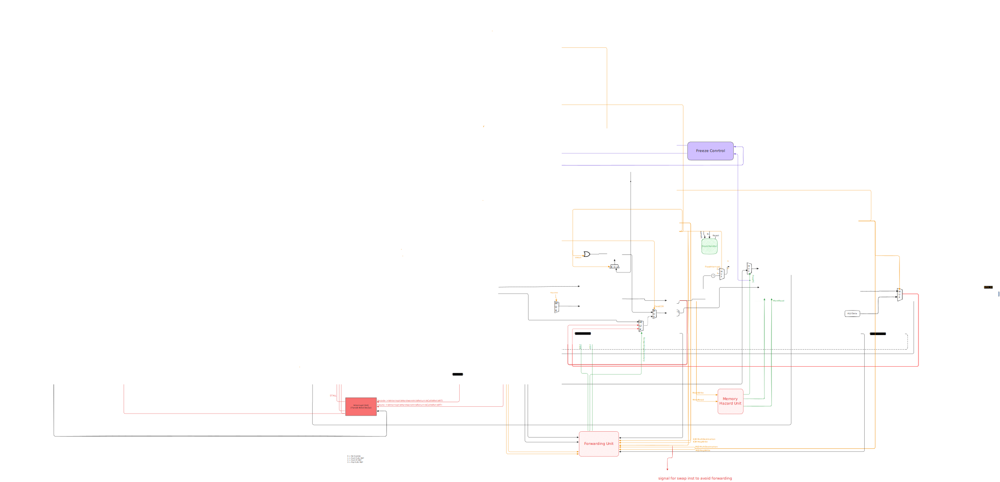

# 5-Staged Pipelined Processor

<div align="center">


**A 32-bit RISC pipelined processor with Von Neumann architecture**

_Cairo University CMP 3010 - Computer Architecture - Fall 2025_

</div>

---

## 📋 Table of Contents

- [Overview](#-overview)
- [Architecture](#-architecture)
- [Features](#-features)
- [Quick Start](#-quick-start)
- [Project Structure](#-project-structure)
- [Instruction Set](#-instruction-set)
- [Usage](#-usage)
- [Documentation](#-documentation)

---

## 🎯 Overview

A fully functional 5-stage pipelined RISC processor implemented in VHDL. The processor features hazard detection, data forwarding, branch prediction, and interrupt handling capabilities.

### Key Specifications

| Specification   | Value                                  |
| --------------- | -------------------------------------- |
| Architecture    | Von Neumann (unified memory)           |
| Data Width      | 32-bit                                 |
| Address Space   | 32-bit word addressable                |
| Registers       | 8 general purpose (R0-R7)              |
| Pipeline Stages | 5 (IF, ID, EX, MEM, WB)                |
| Stack           | Hardware-managed, initial SP = 0x3FFFF |

---

## 🏗 Architecture

<div align="center">



</div>

### Pipeline Stages

```
┌─────────┐    ┌─────────┐    ┌─────────┐    ┌─────────┐    ┌─────────┐
│  FETCH  │───▶│ DECODE  │───▶│ EXECUTE │───▶│ MEMORY  │───▶│WRITEBACK│
│  (IF)   │    │  (ID)   │    │  (EX)   │    │  (MEM)  │    │  (WB)   │
└─────────┘    └─────────┘    └─────────┘    └─────────┘    └─────────┘
     │              │              │              │              │
   PC+1         Decode         ALU/Branch      Load/Store    Register
 Instruction    Registers       Execute        Stack Ops      Update
```

| Stage         | Components                 | Function                         |
| ------------- | -------------------------- | -------------------------------- |
| **Fetch**     | PC, IF/ID Register         | Fetches instruction from memory  |
| **Decode**    | Register File, Control     | Decodes opcode, reads operands   |
| **Execute**   | ALU, CCR                   | Performs arithmetic/logic ops    |
| **Memory**    | Stack Pointer, Data Memory | Handles load/store operations    |
| **Writeback** | Mux                        | Writes results back to registers |

---

## ✨ Features

### Hazard Handling

- **Data Forwarding Unit** - Eliminates most data hazards
- **Memory Hazard Detection** - Handles load-use hazards
- **Pipeline Freeze Control** - Stalls for unresolvable hazards

### Branch Handling

- **2-bit Saturating Counter** - Branch prediction
- **Early Branch Resolution** - Reduces misprediction penalty
- **Conditional Jumps** - JZ, JN, JC support

### Interrupt Support

- **Hardware Interrupts** - External interrupt handling
- **Software Interrupts** - INT instruction
- **Nested Interrupts** - RTI with flag restoration

---

## 🚀 Quick Start

### Prerequisites

- **Python 3.6+** - For the assembler
- **ModelSim** - For simulation
- **VHDL Compiler** - QuestaSim/ModelSim

### 1. Assemble Your Program

```bash
# Basic assembly
python3 ./src/assembler/assembler.py ./tests/test1_basic.asm -o ./memory_data.mem -v --hex
```

### 2. Run Simulation

```bash
# Start ModelSim simulation
vsim -do ./simulation/scripts/run_optimizer.do
```

### Example Assembly Program

```asm
.ORG 0
    LDM R1, 10      ; Load 10 into R1
    LDM R2, 5       ; Load 5 into R2
    ADD R3, R1, R2  ; R3 = R1 + R2 = 15
    OUT R3          ; Output result
    HLT             ; Halt processor
```

---

## 📁 Project Structure

```
5-Staged-Pipelined-Processor/
├── 📂 src/
│   ├── 📂 fetch/           # Fetch stage (PC, IF/ID register)
│   ├── 📂 decode/          # Decode stage (register file, decoder)
│   ├── 📂 execute/         # Execute stage (ALU, CCR)
│   ├── 📂 memory/          # Memory stage (stack pointer)
│   ├── 📂 writeback/       # Writeback stage
│   ├── 📂 control/         # Control unit & hazard detection
│   │   ├── branch-control/     # Branch prediction
│   │   ├── forwarding-unit/    # Data forwarding
│   │   ├── freeze-control/     # Pipeline stalling
│   │   ├── interrupt-unit/     # Interrupt handling
│   │   ├── memory-hazard-unit/ # Load-use detection
│   │   └── opcode-decoder/     # Instruction decoding
│   ├── 📂 common/          # Shared packages & memory
│   ├── 📂 assembler/       # Python assembler
│   ├── processor_top.vhd   # Top-level processor
│   └── system_top.vhd      # System integration
├── 📂 docs/                # Architecture diagrams
├── 📂 tests/               # Assembly test programs
├── 📂 simulation/          # Simulation scripts
└── README.md
```

---

## 📝 Instruction Set

### Instruction Encoding

All instructions are 32-bit wide with variable length (1 or 2 words):

```
Word 1 (Header):
| 31-27  | 26-24 | 23-21 | 20-18 | 17-0   |
| OPCODE |  Rdst | Rsrc1 | Rsrc2 | UNUSED |

Word 2 (Immediate - for 2-word instructions):
| 31-0                          |
| IMMEDIATE VALUE (32-bit)      |
```

### Supported Instructions

| Category          | Instructions             |
| ----------------- | ------------------------ |
| **Control**       | NOP, HLT, SETC           |
| **Arithmetic**    | ADD, SUB, INC, IADD      |
| **Logic**         | AND, NOT                 |
| **Data Movement** | MOV, SWAP, LDM, LDD, STD |
| **Stack**         | PUSH, POP                |
| **I/O**           | IN, OUT                  |
| **Branch**        | JZ, JN, JC, JMP          |
| **Subroutine**    | CALL, RET                |
| **Interrupt**     | INT, RTI                 |

---

## 💻 Usage

### Assembler Options

```bash
python3 ./src/assembler/assembler.py <input.asm> [options]

Options:
  -o OUTPUT          Output file (default: output.mem)
  -f {hex,bin,mem}   Output format (default: mem)
  -v, --verbose      Enable verbose output
  --start-address    Starting memory address (default: 0)
```

### Running Tests

```bash
# Assemble a test program
python3 ./src/assembler/assembler.py ./tests/test1_basic.asm -o ./memory_data.mem -v --hex

# Run simulation in ModelSim
vsim -do ./simulation/scripts/run_optimizer.do
```

### Available Test Programs

| Test File                 | Description            |
| ------------------------- | ---------------------- |
| `test1_basic.asm`         | Basic instruction test |
| `test2_loops.asm`         | Loop constructs        |
| `test3_complex_jumps.asm` | Branch testing         |
| `test4_stack.asm`         | Stack operations       |
| `test5_memory.asm`        | Memory operations      |
| `test6_interrupts.asm`    | Interrupt handling     |
| `test7_all.asm`           | Combined tests         |
| `test8_complex.asm`       | Complex program        |

---

## 📚 Documentation

Detailed documentation is available in the `docs/` folder:

- [Control Unit Documentation](src/control/README.md)
- [Decode Stage Documentation](src/decode/README.md)
- [Assembler Documentation](src/assembler/readme.md)

For architecture details, see the block diagram in `docs/5-Staged-Pipelined-Processor.excalidraw.svg`.

---

## 👥 Contributors

Cairo University - Computer Architecture Course (CMP 3010) - Fall 2025

---

<div align="center">

**⭐ If you find this project helpful, please give it a star! ⭐**

</div>
